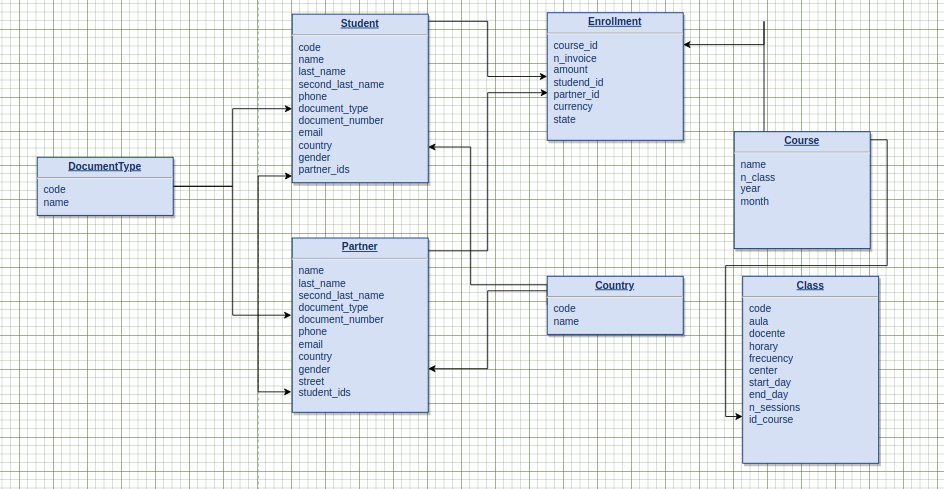

# ChallengeCTC

## 1) Models

  

## 2) Endpoints
<table>
  <tr>
    <td>
      Endpoint
    </td>
    <td>
       HTTP Method
    </td>
    <td>
      CRUD Method	
    </td>
    <td>
      Result
    </td>
  </tr>
  <tr>
    <td>
      partner/partners/
    </td>
    <td>
      GET
    </td>
    <td>
      READ
    </td>
    <td>
      Get all partners
    </td>
  </tr>
  <tr>
    <td>
      partner/students/
    </td>
    <td>
      GET
    </td>
    <td>
      READ
    </td>
    <td>
      Get all students
    </td>
  </tr>
  <tr>
    <td>
      course/courses/
    </td>
    <td>
      GET
    </td>
    <td>
      READ
    </td>
    <td>
      Get all courses
    </td>
  </tr>
  <tr>
    <td>
      course/courses/
    </td>
    <td>
      POST
    </td>
    <td>
      CREATE
    </td>
    <td>
      Add a single course
    </td>
  </tr>
  <tr>
    <td>
      course/classes/
    </td>
    <td>
      GET
    </td>
    <td>
      READ
    </td>
    <td>
      Get all classes
    </td>
  </tr>
  <tr>
    <td>
      course/classes/
    </td>
    <td>
      POST
    </td>
    <td>
      CREATE
    </td>
    <td>
      Add a single classes
    </td>
  </tr>
  <tr>
    <td>
      course/enrollments/
    </td>
    <td>
      GET
    </td>
    <td>
      READ
    </td>
    <td>
      Get all enrollments
    </td>
  </tr>
  <tr>
    <td>
      course/enrollments/
    </td>
    <td>
      POST
    </td>
    <td>
      CREATE
    </td>
    <td>
      Add a single enrollment
    </td>
  </tr>
  <tr>
    <td>
      course/enrollments/:id
    </td>
    <td>
      POST
    </td>
    <td>
      GET/UPDATE/DELETE
    </td>
    <td>
      Add/Update/Delete a single enrollment
    </td>
  </tr>
  
</table>
